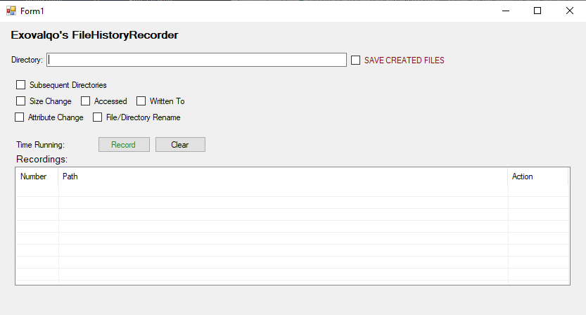

# FileHistoryRecorder
C# Simple Program That Detects File Changes

Features:

**-Save Files**

**-Timer**

**-Check For:**

    //Attribute Changes
  
    // Written To
  
    // Last Accessed
  
    // Resize
  
    // Rename
  
    // Subdirectories

  
Preview:

